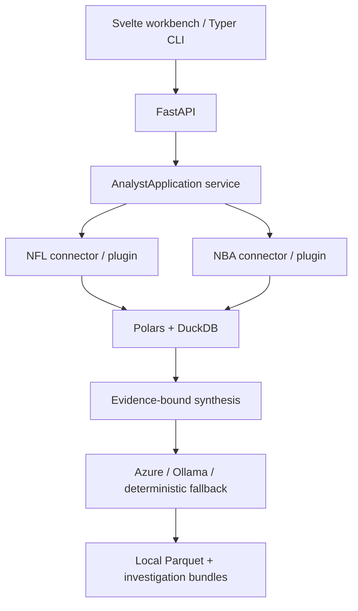

# Open Sports Analyst

Open Sports Analyst is a local-first NFL and NBA analysis workbench that turns natural-language questions into reproducible, evidence-linked investigations over locally
stored [nflverse](https://nflverse.nflverse.com/) and [SportsDataverse](https://py.sportsdataverse.org/docs/nba/) data.

The model plans and explains the investigation. Versioned analytical tools, Polars, and constrained read-only DuckDB SQL calculate the results. Every measured claim must cite
evidence produced by those tools; the model cannot invent measurements or execute arbitrary Python.

## What the application does

- Runs NFL team analysis for passing, rushing, and overall offense, plus player analysis for quarterbacks, receivers, and ball carriers.
- Runs NBA team or player analysis across full seasons and validated season segments, with an optional team-stint filter for traded players.
- Provides the mature NFL diagnostic suite: trends, benchmarks, outliers, situational splits, play mix, opponent context, change points, player usage, and availability
  context.
- Provides NBA v1 box-score comparisons, multi-season trend charts, lineup-rate comparisons when lineup releases are synced, and diversified play/possession evidence from both
  comparison windows.
- Surfaces NFL evidence in an interactive field schematic and NBA evidence in a basketball tablet with recorded shot, score, and lineup context.
- Selects representative evidence deterministically across different games and contexts, labeling typical examples, metric-relevant examples, support for the measured change,
  and counterexamples.
- Produces evidence-bound findings, charts, methodological caveats, team-themed HTML reports, and Markdown exports.
- Saves investigations locally, supports follow-up conversations as child investigations, and allows complete investigation threads to be deleted.
- Remains usable without a configured model by generating a deterministic evidence report.

Open Sports Analyst ships independent NFL and NBA plugins. Persistent sport tabs preserve each sport's unfinished form state while changing its subjects, seasons, periods,
metrics, datasets, and evidence renderer.

## Application tour

The Svelte workbench provides:

1. **Local Data Library** — select seasons and sport-specific packages, inspect local coverage, and sync data without using the CLI.
2. **Scope** — choose an NFL or NBA team/player, analysis domain, season period, and comparison design using searchable, data-driven controls. Team and player searches filter
   the options already loaded in the browser.
3. **Metrics and diagnostic cuts** — use the recommended defaults, select all available metrics, or constrain the analysis to specific measurements and situations.
4. **Investigation question** — ask a free-text analytical question or cycle through valid examples.
5. **Live analysis** — follow backend stage progress while evidence is produced and reviewed.
6. **Report and evidence inspector** — inspect every finding, all evidence attached to it, charts, baseline/comparison evidence groups, selection rationale, and provenance.
7. **Film Room** — reopen, continue, export, or delete saved investigation threads.

## Quick start

### Requirements

- Python `>=3.13,<3.15`
- [uv](https://docs.astral.sh/uv/)
- Node.js 20 or newer
- npm

### Install

```powershell
git clone <repository-url>
Set-Location SportsAnalyst

Copy-Item .env.example .env
uv sync --extra test

Set-Location frontend
npm ci
Set-Location ..
```

### Run

Start the API in one terminal:

```powershell
uv run sports-analyst serve
```

Start the web application in a second terminal:

```powershell
Set-Location frontend
npm run dev
```

Open [http://127.0.0.1:5173](http://127.0.0.1:5173). Vite proxies `/api` requests to the FastAPI server at `http://127.0.0.1:8767`.

You do **not** need to run a data-sync command before launching the application. Open the data manager for the selected sport, choose seasons and packages, and select **Sync
Selected Data**. NBA defaults to play-by-play, schedules, team box scores, and player box scores. The application reports whether the optional live transport is installed, but
current NBA investigations use synced bulk releases and do not make live NBA Stats calls.

## Model providers

The application supports Azure Foundry and Ollama. Provider settings remain in the backend and are never sent to the browser or analysis tools.

### Azure Foundry

Azure Foundry is the default provider and uses the OpenAI-compatible `/openai/v1/` endpoint with the Responses API.

```dotenv
MODEL_PROVIDER=azure_foundry
MODEL=gpt-5.6-luna
FOUNDRY_ENDPOINT=https://YOUR-RESOURCE.openai.azure.com/openai/v1/
FOUNDRY_API_KEY=
REASONING_EFFORT=medium
```

If `FOUNDRY_API_KEY` is empty, authentication uses `DefaultAzureCredential`. For local development, sign in with a supported Azure developer credential such as Azure CLI
before starting the API.

### Ollama

```dotenv
MODEL_PROVIDER=ollama
OLLAMA_BASE_URL=http://127.0.0.1:11434
OLLAMA_MODEL=qwen3:8b
```

The selected Ollama model must support the structured output and tool-calling behavior needed by the agent workflow.

Check the active configuration with:

```powershell
uv run sports-analyst providers check
```

If provider construction or model synthesis fails, the completed deterministic evidence remains available and the saved report is marked as a fallback.

### LangSmith tracing

LangSmith tracing is opt-in. Add the following to `.env` to trace the deterministic pipeline and Deep Agent activity:

```dotenv
LANGSMITH_TRACING=true
LANGSMITH_ENDPOINT=https://api.smith.langchain.com
LANGSMITH_API_KEY=
LANGSMITH_PROJECT=open-sports-analyst-local
# LANGSMITH_WORKSPACE_ID=
```

Each investigation is a root trace with child spans for planning, data loading, deterministic analysis, synthesis, and persistence. Follow-ups use the original investigation
ID as their `thread_id`, while retaining their own `investigation_id`. Trace metadata contains scope identifiers and counts, not raw datasets or credentials. Tracing is
fail-open: configuration or delivery failures are logged but do not fail an investigation.

## Data

Data is downloaded through `nflreadpy` (NFL) or SportsDataverse (NBA), normalized to local Polars/Parquet data, and registered in a DuckDB catalog. The repository does not
contain or redistribute sports datasets.

### NFL packages

|        Category         | Packages                                                                               | Used for                                                                                                                     |
|:-----------------------:|----------------------------------------------------------------------------------------|------------------------------------------------------------------------------------------------------------------------------|
|        Required         | `play_by_play`                                                                         | Core metrics, trends, splits, outliers, benchmarks, representative plays, and schematics                                     |
| Team and player context | `player_stats`, `rosters`, `weekly_rosters`, `injuries`, `snap_counts`, `depth_charts` | Usage, availability, roster composition, and continuity                                                                      |
|      Play context       | `participation`, `ftn_charting`, `schedules`                                           | Recorded participants, personnel, pressure, routes, coverage, motion, play action, RPO, screens, opponents, and game context |
|     Next Gen Stats      | `nextgen_passing`, `nextgen_receiving`, `nextgen_rushing`                              | Passing, receiving, and rushing context published through nflverse                                                           |
| PFR advanced statistics | `pfr_passing`, `pfr_rushing`, `pfr_receiving`, `pfr_defense`                           | Weekly advanced player and defensive context                                                                                 |
|    Shared references    | `players`, `teams`                                                                     | Cross-source identity resolution and canonical team metadata                                                                 |

Package availability varies by season. The UI displays each package's first supported season, disables invalid combinations, and reports local coverage for the selected years.
Shared `players` and `teams` references are stored once rather than once per season.

Supplemental data is optional. The service selectively loads only packages relevant to the question and domain. When a useful package has not been synced, the investigation
continues with available evidence and records a capability caveat.

### NBA packages and availability

NBA seasons are stored by ending year: `2026` is displayed as `2025–26`. Core ESPN-backed releases begin in 2002. The default NBA sync contains `play_by_play`, `schedules`,
`team_boxscores`, and `player_boxscores`. The sync catalog covers every published high-level NBA loader in SportsDataverse 0.0.75, including ESPN and NBA Stats schedules, box
scores, shots, standings, officials, coaches, game logs, season statistics, rosters, game rosters, draft results, identities, impact, play-by-play, and five-player lineups.
NBA Stats season and game rosters are available from 1997, while the separate ESPN season-roster release begins in 2025. Named segments are offered only when schedule rows and
reviewed boundaries resolve qualifying games. V3 play-by-play, lineup, and possession loaders remain local/live-only compatibility sources because no corresponding bulk
release tags are currently published; they are not shown as downloadable packages.

SportsDataverse is constrained to the pre-1.0 `>=0.0.75,<0.1` compatibility line (the current lockfile resolves 0.0.75). Loader calls are isolated inside
`SportsDataverseNBAConnector`, where schemas, identifiers, season conventions, checksums, caching, and package availability are normalized before the analysis plugin sees
them.

### Local storage and provenance

By default, files are stored in the platform-specific user data directory returned by `platformdirs`:

```text
open-sports-analyst/
├── catalog.duckdb
├── raw/nflverse/*.parquet
├── raw/nba/*.parquet
└── investigations/<investigation-id>/
```

Set `DATA_DIR` in `.env` to use a different root directory.

Every dataset manifest records its sport, source, season, acquisition time, schema, package version, local SHA-256, size, license, and attribution. Catalog lookups, SQL views,
history, and caches are partitioned by sport so an NBA request cannot resolve an NFL manifest. Investigation bundles also retain tool versions, parameters, execution timing,
result hashes, evidence identifiers, charts, and reports.

Framework code is MIT-licensed. Synced datasets and derived outputs retain the attribution and terms recorded in their source manifests.

### NBA controls

NBA supports team and player subjects, including an optional team-stint filter for traded players. The team selector contains only the 30 current franchises; All-Star, Rising
Stars, and other event teams are excluded. Player options are resolved from synced data for those franchises. Team and player combo boxes search their already-loaded option
lists locally instead of issuing a new request for each keystroke. Comparison designs include full-season trends, named segment comparisons, and a current pre/post-All-Star
milestone comparison. Validated segments include the regular season, playoffs, opening month, pre/post-All-Star, post-trade-deadline, play-in, each playoff round, and the NBA
Finals. Schedule labels and reviewed milestone dates determine which choices appear for each season.

Team domains cover offense, defense, shooting, playmaking, rebounding, turnovers, and lineups. Player domains cover scoring, shooting, playmaking, rebounding, usage, impact,
and compatible lineup context. Subject mode controls which domains and metrics are offered, so team-only measurements are not presented as player statistics. NBA analysis
calculates selected box-score or canonical five-player lineup metrics for the two comparison windows. Full-season ranges also chart each included season. Reports now execute
game-level trend and outlier analysis, team league benchmarks, available opponent context, shooting-zone profiles, and unit-level lineup analysis with player names, minutes,
possessions, ratings, and new/returning/departed status. Representative NBA evidence is selected from both windows and includes period, clock, score, event, player/team context, a half-court shot marker when
coordinates exist, and lineup cards when recorded on-court identities are available. Missing coordinates or players fall back to textual evidence rather than inferred
positions.

## Analysis controls

### NFL domains and default metrics

|       Domain       | Recommended metrics                                         |
|:------------------:|-------------------------------------------------------------|
|      Passing       | EPA/dropback, success rate, CPOE, explosive-pass rate       |
|      Rushing       | EPA/rush, rush success rate, yards/rush, explosive-run rate |
|  Overall offense   | EPA/play, success rate, yards/play, turnover rate           |
| Quarterback player | EPA/dropback, success rate, CPOE, yards/dropback            |
|  Receiving player  | targets/game, EPA/target, catch rate, yards/target          |
|   Rushing player   | carries/game, EPA/carry, rush success rate, yards/carry     |

Additional passing metrics include yards/play, sack rate, interception rate, air yards/attempt, and YAC/completion. Additional rushing metrics include stuff rate and rushing
first-down rate.

Selected metrics are **included** in the investigation. **Use Recommended Metrics** replaces the current selection with the domain's recommended set. Diagnostic cuts constrain
which situational dimensions the analyst decomposes: down, distance, field zone, score state, shotgun, no huddle, personnel, and formation. Unavailable or materially
incomplete fields are disabled or omitted.

### NFL comparison designs

- **Full seasons** analyzes every locally available season in an inclusive range. Selecting 2022 through 2025 measures 2022, 2023, 2024, and 2025; endpoint diagnostics compare
  the first and final seasons.
- **Custom week ranges** compares two explicit inclusive week windows, which may be in the same or different seasons.
- **Before vs. after** compares two week ranges within one season around a selected boundary.

Team comparison windows require at least 30 qualifying plays. Player comparisons use every attributed play available in each window, flag samples below 10 as highly uncertain,
and omit only metrics whose required values are unavailable. Quarterback reports can add compatible synced weekly player stats, Next Gen passing, and PFR passing evidence
without silently substituting those published statistics for differently defined play-derived metrics. Situational subgroups still require at least 10 qualifying plays in both
windows. Results are observational and do not establish causality.

### NBA metrics

NBA team metrics include points per game, estimated offensive and defensive rating, estimated pace, win percentage, field-goal and three-point percentage, effective and true
shooting percentage, three-point rate, assists, assist-to-turnover ratio, rebounds, offensive rebounds, turnovers, and turnover rate. Player metrics include scoring and
shooting measures, assists, rebounds, turnovers, minutes, an involvement-per-minute usage proxy, and recorded box-score plus/minus. Synced lineup releases add possession-weighted
offensive, defensive, and net rating (minutes are used only when possessions are unavailable). Lineup rows are restricted to advanced measures, one published per-mode, the
requested regular-season/playoff phase, and one row per five-player group before aggregation.

Possessions used for team ratings and pace are estimated as `FGA - OREB + TOV + 0.44 × FTA`. These values are descriptive box-score estimates, not the published V3 possession
count. NBA v1 requires at least one qualifying box-score row in each window; it does not apply the NFL 30-play and 10-play subgroup thresholds.

Where at least two games exist in each window, box-score changes include descriptive game-level uncertainty intervals. These intervals, lineup ratings, league ranks, and
opponent-strength summaries are observational context and should not be interpreted as causal player or coaching effects.

## Analytical capabilities

The current NFL tool set includes:

- Typed scope validation and metric explanations.
- Window and inclusive season-range comparisons.
- Weekly trends, confidence intervals, moving averages, and sustained-versus-outlier classification.
- Game outlier ranking and league/conference benchmarks.
- Situational splits, play-mix comparison, metric decomposition, and game-state analysis.
- Leave-one-game-out opponent adjustment and descriptive change-point detection.
- Deterministic representative evidence from both windows, including typical plays, metric examples, evidence supporting the measured change, and counterexamples.
- Player identity resolution and a normalized player-week layer.
- First-class quarterback, receiving, and rushing player-window comparisons, trends, charts, and representative plays.
- Player usage change, position-group availability, lineup continuity, and continuity decomposition.
- Quarterback-receiver pair analysis.
- Roster, injury, depth-chart, participation, FTN, Next Gen Stats, PFR, and schedule context joins.

See the [Sports Tool Guide](docs/tool-guide.md) for formulas, inputs, data requirements, execution status, evidence behavior, limitations, and plugin extension guidance for
both sports.

### Representative evidence policy

NFL and NBA use the shared, versioned `diverse-v1` selector. It chooses up to four distinct items per window in a stable role order: **typical**, **metric example**,
**supports change**, and **counterexample**. Selection is based on the requested metric or the closest sport-appropriate event value, the observed direction between windows,
and the quality of the available context. It prefers different games and penalizes repeated event types, opponents, and periods; if the sample is sparse, it returns fewer
distinct items instead of duplicating or fabricating evidence.

Every selected item records its window, role, reason, selection metric, candidate-pool size, and selector version. NFL evidence is scored with the selected play-level metric
when available and otherwise falls back to EPA. NBA evidence uses domain-relevant event scoring and adds possession or lineup context only when a compatible synced source
contains it. The report groups the selected evidence by baseline and comparison window so users can see both the measured pattern and credible exceptions.

### Play schematics

Selecting a representative play opens a team-themed field view containing the line of scrimmage, line to gain, recorded situation, approximate formation, player markers, and a
highlighted ball path. When participation data is available, markers use recorded on-field identities and positions; otherwise the component falls back to a
formation/personnel template. Player names appear on hover.

Pass, catch, after-catch, rushing, sack, turnover, recovery, return, and touchdown markers are constructed from recorded play-by-play fields. These are analytical schematics,
not player-tracking replays: exact coordinates, routes, assignments, and ball trajectories are unavailable and are not presented as measured tracking data.

## Investigations and follow-ups

An initial investigation:

1. Resolves and validates the selected scope.
2. Loads the required Parquet columns and relevant supplemental packages.
3. Builds a typed plan from the selected sport plugin's registered operations.
4. Executes deterministic analysis and records evidence.
5. Uses an adaptive Deep Agents workflow to review and synthesize the result.
6. Validates every citation before saving the bundle and reports.

Simple questions use a smaller agent topology; broader diagnostic questions add efficiency, situational, and evidence-review specialists.

Follow-ups are saved as child investigations in a conversation-style thread. They reuse the root investigation's immutable evidence and charts, which makes follow-ups faster
and keeps their citations reproducible. A follow-up that requires a new dataset, scope, metric, or algorithm should be started as a new investigation.

When an analysis completes, the frontend validates and loads the saved bundle and its conversation thread together before replacing the loading view. Transient incomplete
reads are retried with bounded backoff. If the progress stream disconnects or times out, the frontend polls the saved investigation status and resumes loading once persistence
is complete, preventing an empty report from being shown during the handoff.

## CLI usage

The web application is the primary interface. The CLI supports NFL and NBA data sync, manifest inspection, investigation inspection/export, and NFL full-season `ask` requests.
NBA investigation authoring currently uses the web application or HTTP API.

```powershell
# Sync play-by-play only
uv run sports-analyst data sync nfl --season 2024 --season 2025

# Sync selected supplemental packages
uv run sports-analyst data sync nfl `
  --season 2024 --season 2025 `
  --dataset play_by_play `
  --dataset rosters `
  --dataset injuries `
  --dataset snap_counts `
  --dataset participation

# Sync the default bulk NBA packages for two seasons
uv run sports-analyst data sync nba --season 2025 --season 2026

# Add optional NBA shot and lineup packages where supported
uv run sports-analyst data sync nba --season 2025 --season 2026 `
  --dataset play_by_play --dataset schedules `
  --dataset team_boxscores --dataset player_boxscores `
  --dataset shots --dataset lineups

# Inspect local manifests
uv run sports-analyst data list --sport nba

# Run full-season analyses
uv run sports-analyst ask "Why did Kansas City's passing efficiency change?" `
  --team KC --compare 2024:2025 --domain passing

uv run sports-analyst ask "How did Chicago's rushing performance change?" `
  --team CHI --compare 2024:2025 --domain rushing

# Inspect and export saved work
uv run sports-analyst investigate show <investigation-id>
uv run sports-analyst investigate export <investigation-id> --format html

# Runtime and evaluation metadata
uv run sports-analyst capabilities
uv run sports-analyst providers check
uv run sports-analyst eval run
```

Run `uv run sports-analyst --help` or append `--help` to a subcommand for its current options.

## HTTP API

FastAPI exposes:

|      Area      | Endpoints                                                                                                                                                                                |
|:--------------:|------------------------------------------------------------------------------------------------------------------------------------------------------------------------------------------|
|    Runtime     | `GET /api/capabilities`, `GET /api/sports`                                                                                                                                               |
|      Data      | `GET /api/datasets?sport={sport}`, `POST /api/datasets/{sport}/sync`, `GET /api/dataset-jobs/{id}/events`                                                                                |
| Sport catalog  | `GET /api/sports/{sport}/options`, `GET /api/sports/{sport}/tools`, `GET /api/sports/{sport}/metrics/{metric}`, `GET /api/sports/{sport}/players`                                        |
| Investigations | `POST /api/investigations`, `GET /api/investigations?sport={sport}`, `GET/DELETE /api/investigations/{id}`, `GET /api/investigations/{id}/events`, `GET /api/investigations/{id}/status` |
|  Conversation  | `GET /api/investigations/{id}/thread`, `POST /api/investigations/{id}/follow-ups`                                                                                                        |
|    Evidence    | `GET /api/investigations/{id}/evidence/{evidence_id}`, `POST /api/investigations/{id}/evidence/batch`                                                                                    |
|    Reports     | `GET /api/investigations/{id}/export?format=html`, `GET /api/investigations/{id}/export?format=markdown`                                                                                 |

Dataset sync and investigation progress use server-sent events. The frontend recovers interrupted investigation streams through the status endpoint and validates the complete
bundle and thread before rendering them. History responses are compact summaries; complete bundles, threads, and evidence are loaded on demand.

Interactive OpenAPI documentation is available at [http://127.0.0.1:8767/docs](http://127.0.0.1:8767/docs) while the API is running.

## Architecture



- **Svelte 5, TypeScript, Vega-Lite** — responsive dark-mode workbench, charts, evidence inspection, and play schematics.
- **FastAPI and Typer** — HTTP/SSE and command-line interfaces over the same application service.
- **Polars and DuckDB** — projected Parquet scans, deterministic analytics, catalog storage, and constrained SQL.
- **LangChain Deep Agents** — provider-portable planning and synthesis with adaptive specialist use.
- **Altair and vl-convert-python** — chart specifications and offline report rendering.
- **Pydantic** — versioned public contracts and validation.

Performance-sensitive paths use selective column loading, a bounded dataset cache, vectorized bootstrap calculations, compact history payloads, batch evidence retrieval,
immutable follow-up reuse, and bounded event histories.

## Safety and analytical boundary

The agent has no host shell, filesystem, package installation, web search, external network, or unrestricted code-execution tool. It can compose registered analytical
functions and constrained read-only SQL. SQL accepts one `SELECT`, `WITH`, or `EXPLAIN` statement and rejects mutation, extension loading, file/network functions, multiple
statements, and oversized results.

If an algorithm is unavailable, the application reports the limitation instead of generating and executing Python. `CustomAnalysisRunner` exists as a future extension
protocol; core currently ships only `DisabledCustomAnalysisRunner` and reports `custom_analysis=false`.

## Configuration

All settings use the following environment variables and may be placed in `.env`.

|              Variable              |              Default              | Purpose                                               |
|:----------------------------------:|:---------------------------------:|-------------------------------------------------------|
|             `DATA_DIR`             |   Platform user-data directory    | Local catalog, Parquet, and investigation root        |
|          `MODEL_PROVIDER`          |          `azure_foundry`          | Active provider: `azure_foundry` or `ollama`          |
|              `MODEL`               |          `gpt-5.6-luna`           | Azure Foundry model/deployment name                   |
|         `FOUNDRY_ENDPOINT`         |               Empty               | HTTPS endpoint ending in `/openai/v1/`                |
|         `FOUNDRY_API_KEY`          |               Empty               | Optional API key; empty uses `DefaultAzureCredential` |
|         `REASONING_EFFORT`         |             `medium`              | Provider reasoning setting                            |
|         `OLLAMA_BASE_URL`          |     `http://127.0.0.1:11434`      | Ollama server                                         |
|           `OLLAMA_MODEL`           |            `qwen3:8b`             | Ollama model                                          |
|          `SQL_ROW_LIMIT`           |              `10000`              | Maximum constrained-SQL result rows                   |
|   `EVENT_STREAM_TIMEOUT_SECONDS`   |               `120`               | SSE inactivity timeout before frontend recovery       |
|         `DATASET_CACHE_MB`         |               `384`               | In-memory analytical dataset cache; `0` disables it   |
| `VERIFY_DATASET_CHECKSUMS_ON_LOAD` |              `false`              | Recalculate SHA-256 whenever a manifest is loaded     |
|   `INVESTIGATION_HISTORY_LIMIT`    |               `50`                | Default compact history page size                     |
|            `LOG_LEVEL`             |              `INFO`               | Backend logging level                                 |
|        `LANGSMITH_TRACING`         |              `false`              | Enable LangSmith tracing                              |
|        `LANGSMITH_ENDPOINT`        | `https://api.smith.langchain.com` | LangSmith API endpoint                                |
|        `LANGSMITH_API_KEY`         |               Empty               | LangSmith API key                                     |
|        `LANGSMITH_PROJECT`         |    `open-sports-analyst-local`    | Destination LangSmith project                         |
|      `LANGSMITH_WORKSPACE_ID`      |               Empty               | Optional workspace for scoped API keys                |

Set `LOG_LEVEL=DEBUG` for lightweight diagnostics. Logs include IDs, lifecycle stages, timings, result counts, model/fallback outcomes, citation repair, and event timeouts.
They intentionally exclude prompts, questions, evidence contents, SQL text, managed paths, credentials, and raw model responses.

## Development and verification

```powershell
# Backend
uv run ruff check .
uv run --extra test pytest

# Frontend
Set-Location frontend
npm run check
npm run test
npm run build
```

The maintained suite intentionally focuses on major workflows and compatibility contracts: sport-isolated sync and investigation behavior, NFL/NBA analysis, API persistence
and recovery, frontend sport/subject state, and evidence rendering. Backend tests use synthetic fixtures and do not require model credentials or network access. Live provider
and external dataset download tests remain opt-in.

## License

Open Sports Analyst is released under the [MIT License](LICENSE). Synced NFL and NBA datasets retain the attribution and terms reported by their source manifests.
